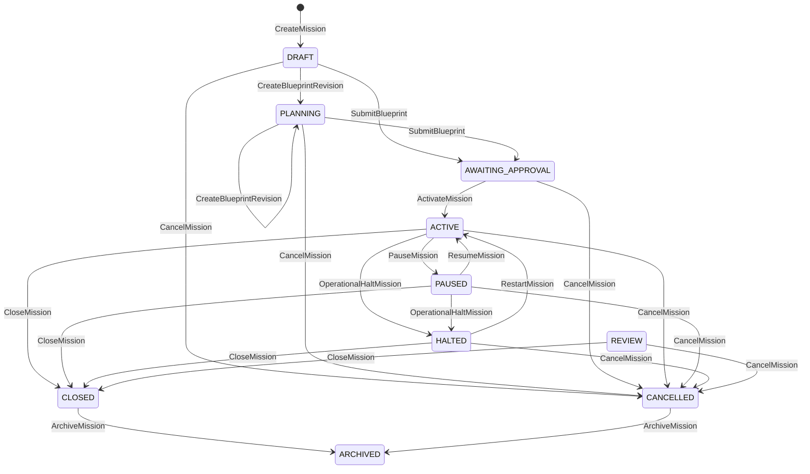

# Mission context

The Mission context is the first executable ONYX bounded context. Its application service accepts canonical command envelopes and returns canonical event envelopes. Aggregate state, event history, and operation-id records are committed together by the repository boundary.

## Lifecycle

## Command authority scopes

| Command | Required scope |
| --- | --- |
| `CreateMission` | `mission:create` |
| `CreateBlueprintRevision` | `mission:blueprint:create` |
| `SubmitBlueprint` | `mission:blueprint:submit` |
| `ActivateMission` | `mission:activate` |
| `PauseMission` | `mission:pause` |
| `ResumeMission` | `mission:resume` |
| `OperationalHaltMission` | `mission:halt` |
| `RestartMission` | `mission:restart` |
| `CloseMission` | `mission:close` |
| `CancelMission` | `mission:cancel` |
| `ArchiveMission` | `mission:archive` |

Authority proofs must be unexpired. Optional expected version, lifecycle epoch, and authority epoch values are checked before mutation.

## Idempotency and consistency

- Replaying an identical `operation_id` returns the original event.
- Reusing an `operation_id` with different command content is rejected.
- Mutations may provide `expected_version` for optimistic concurrency.
- Organization boundaries are checked before exposing or mutating an aggregate.
- Aggregate state, emitted event, and operation record share one repository commit boundary.
- Event integrity metadata contains a SHA-256 digest over canonical event content.

The runtime supports both in-memory and durable SQLite repository adapters while preserving the same atomic commit boundary.
