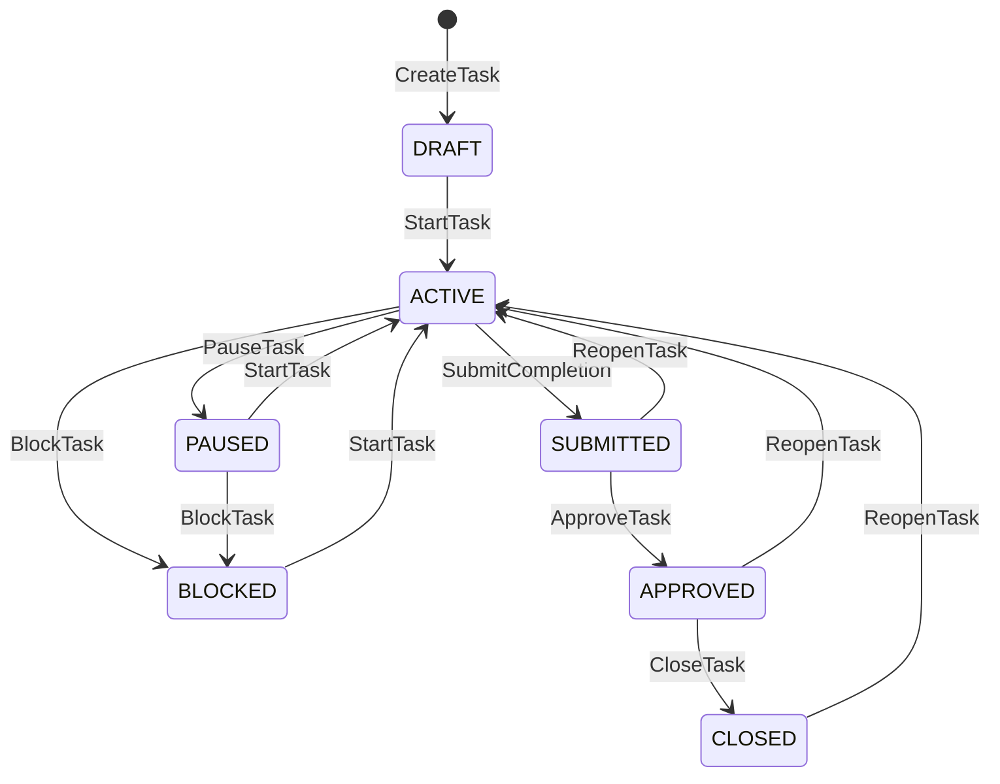

# Work context

The Work context owns Task aggregates and implements every v2.0 Work command. Payloads are exact, versioned contracts; unknown fields are rejected.

## Lifecycle

Non-terminal states can be cancelled. Closure, reopening, and cancellation increment the lifecycle epoch to fence stale commands.

## Cross-context boundary

Work references a Mission but never modifies Mission state. `WorkService` depends on a narrow `requireMission(organizationId, missionId)` port. The current composition maps that port to the Mission query service; a future deployment can replace it with a remote contract adapter without changing Work domain logic.

Creation is rejected when:

- the referenced Mission does not exist;
- the Mission belongs to another organization;
- the caller lacks an unexpired `work:create` authority proof;
- the Task identifier already exists;
- `expected_version`, when supplied, is not zero;
- the operation identifier was previously used with different content.

## Persistence boundary

Task state, its emitted event, and the idempotency record are committed through one repository operation. Both in-memory and SQLite adapters preserve the same atomic behavior for creation and mutation.

## Query surface

- get a Task by identifier and organization;
- list Tasks inside an organization;
- read aggregate event history using `after_version` and `limit` bounds.

## Supporting mutations

`AssignOwner`, `ChangePriority`, and `AddDependency` update active planning metadata without changing lifecycle status. Dependencies must exist in the same organization and Mission, cannot reference the task itself, and cannot be duplicated.
